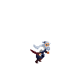

# IZO: Experience

---

**IZO** é minha primeira criação independente na Unity, realizado com o objetivo de conclusão do bootcamp de criação de jogos com a Unity.  
Nesta experiência, foquei em utilizar a grande maioria dos conceitos aprendidos ao longo do bootcamp, como:

- 🎞️ Manipulação de animações (spritesheets e transições)  
- 💥 Efeitos de tela (como shake, fade e flash)  
- 🧠 Programação orientada a objetos com C#  
- 🔊 Manipulação de áudio (músicas e efeitos sonoros)  
- 🧩 Sistema de HUD com transições e lógica de fases  
- 🗂️ Organização modular de scripts e cenas  

---

🎮 **Jogue agora na Unity Play:**  
[https://play.unity.com/en/games/6a7ca3eb-5ae1-4a82-a091-d43a05d42044/izoexperience](https://play.unity.com/en/games/6a7ca3eb-5ae1-4a82-a091-d43a05d42044/izoexperience)

---

## 🎨 Créditos

Os assets utilizados nesta experiência não são de minha autoria. Seguem os links e autores:

**Imagens:**

- [Boss Demon Slime - chierit](https://chierit.itch.io/boss-demon-slime)  
- [Samurai 2D Pixel Art - xzany](https://xzany.itch.io/samurai-2d-pixel-art)  
- [Evil Wizard - LuizMelo](https://luizmelo.itch.io/evil-wizard-2)  
- [Bringer of Death - Clembod](https://clembod.itch.io/bringer-of-death-free)

**Sons:**

- [Purgatory Extreme Metal Music Pack - DavidKBD](https://davidkbd.itch.io/purgatory-extreme-metal-music-pack)

---

## 📦 Tecnologias Utilizadas

- Unity (Engine)  
- C# (Programação)  
- Git & GitHub (Controle de versão)  
- Gimp 3 (Sprites)

---
